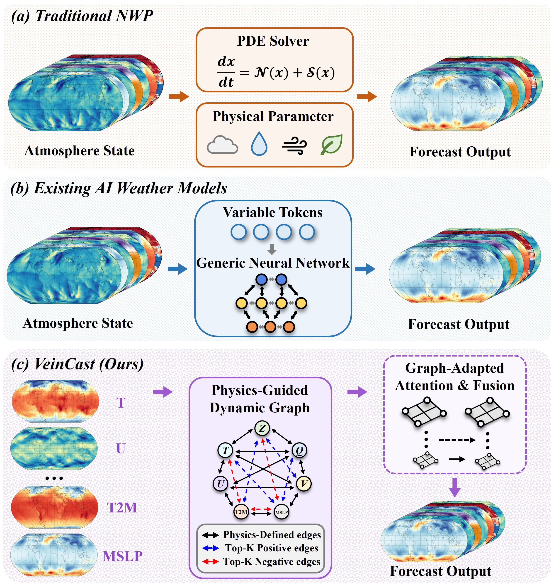
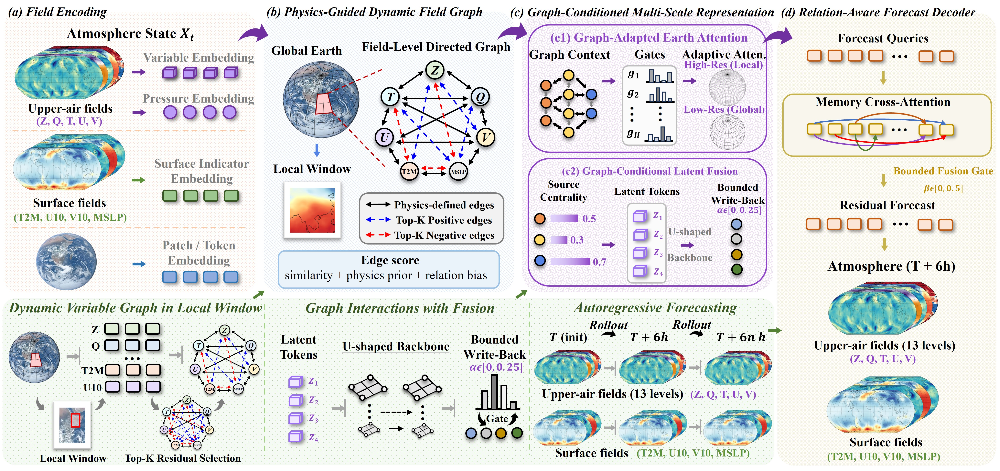

<div align="center">

# VeinCast

### Physics-Guided Dynamic Field Graphs with Graph-Conditioned Fusion for Global Medium-Range Weather Forecasting

[](https://www.python.org/)
[](https://pytorch.org/)
[](#)

VeinCast is a closed-set global weather forecaster that explicitly models
state-dependent interactions among meteorological fields. A shared 6-hour
transition operator predicts the complete registered 69-field atmosphere and
is applied autoregressively for medium-range forecasts.

</div>

<p align="center">
  
</p>

<p align="center"><em>VeinCast introduces a physics-guided dynamic field graph and graph-conditioned fusion in place of generic channel mixing.</em></p>

## Highlights

- **Physics-Guided Dynamic Field Graph.** A stable relation registry provides
  physically meaningful edges, while Top-K positive and negative residual
  edges capture state-dependent couplings inside each spatial window.
- **Graph-Conditioned Latent Fusion.** Graph context and source-node centrality
  guide aggregation into four latent slots. A U-shaped backbone models shared
  multiscale structure before bounded feedback returns information to the field
  pathway.
- **Relation-Aware Forecast Decoder.** Each of the 69 registered output fields
  reads field and latent memories through relation-aware cross-attention.
- **Stable autoregressive forecasting.** VeinCast learns one 6-hour transition
  and uses a progressive `1 -> 2 -> 4` rollout curriculum with detached
  predicted inputs.
- **Paper-aligned objective.** Training uses only a masked,
  latitude-weighted Huber loss in normalized space (`delta = 2`), without an
  auxiliary reconstruction term or equation-based physical regularizer.

## Architecture

<p align="center">
  
</p>

<p align="center"><em>Overall technical flow of VeinCast: field encoding, dynamic graph construction, graph-conditioned multiscale fusion, and relation-aware decoding.</em></p>

The default implementation operates on a `121 x 240` latitude-longitude grid:

| Component | Default setting |
|---|---|
| Forecast state | 69 fields, `121 x 240` |
| Patch size | `4 x 4` |
| Field encoder | widths `96/192`, depths `2/4`, heads `4/8` |
| Earth window | `4 x 8` |
| Dynamic graph | physical prior + Top-K `4` residual edges |
| Fusion memory | 4 latent slots, width `384` |
| Latent U-Backbone | depths `3/4/2`, heads `12/24/12` |
| Base transition | 6 hours |
| Training rollout | 1, 2, and 4 steps |

For an exact paper-to-code mapping, see
[docs/PAPER_ALIGNMENT.md](docs/PAPER_ALIGNMENT.md).

## Forecast fields

VeinCast uses a fixed registry of 69 ERA5 fields:

- **65 upper-air fields:** geopotential (`z`), temperature (`t`), specific
  humidity (`q`), zonal wind (`u`), and meridional wind (`v`) at 13 pressure
  levels: `50, 100, 150, 200, 250, 300, 400, 500, 600, 700, 850, 925, 1000 hPa`.
- **4 surface fields:** 2 m temperature (`t2m`), 10 m zonal wind (`u10`),
  10 m meridional wind (`v10`), and mean sea-level pressure (`msl`).

Both input and output follow this canonical order. The reported interface does
not interpolate or predict unregistered pressure levels.

## Installation

```bash
git clone https://github.com/Zhisheng-researcher/VeinCast.git
cd VeinCast

python -m venv .venv
source .venv/bin/activate
python -m pip install --upgrade pip
python -m pip install -e .
```

The editable installation exposes three commands: `veincast-train`,
`veincast-evaluate`, and `veincast-predict`. The same entry points can also be
run as Python modules under `veincast.cli`.

## Data preparation

Update `dynamic_path`, `static_path`, and `stats_path` in the selected file
under `configs/`.

The dynamic NetCDF file must contain:

- a `time` coordinate sampled every 6 hours;
- latitude and longitude dimensions named `latitude`/`longitude` or `lat`/`lon`;
- upper-air variables with a pressure dimension named `level`,
  `pressure_level`, `isobaricInhPa`, or `plev`;
- the variables and pressure levels listed above on the same `121 x 240` grid.

The optional static file may provide `land_sea_mask` and `orography`. Five
spherical geographic channels are generated internally. If surface pressure
(`sp`) is available in the dynamic file, pressure levels below the local
surface are excluded from supervision.

Normalization statistics are fitted on the configured training period when
`stats_path` does not yet exist, then stored for reuse. ERA5 data and pretrained
checkpoints are not included in this repository.

## Training

VeinCast uses a three-stage autoregressive curriculum. Each new stage loads
model weights from the previous best checkpoint while restarting the optimizer,
scheduler, and gradient scaler.

### Stage 1: one-step transition

```bash
veincast-train --config configs/veincast_stage1.json
```

### Stage 2: two-step rollout

```bash
veincast-train \
  --config configs/veincast_stage2_rollout2.json \
  --init-from artifacts/veincast_stage1/best.pt
```

### Stage 3: four-step rollout

```bash
veincast-train \
  --config configs/veincast_stage3_rollout4.json \
  --init-from artifacts/veincast_stage2_rollout2/best.pt
```

For distributed training, launch the same entry point with `torchrun`; the
configured batch size is per process. For example:

```bash
torchrun --standalone --nproc_per_node=8 -m veincast.cli.train \
  --config configs/veincast_stage1.json
```

Stages 2 and 3 use sample-wise teacher forcing with probability `0.25` and
detached rollout. From the second autoregressive step onward, the
field-availability mask is set to one because each prediction contains all 69
fields.

## Evaluation

Evaluate recursive forecasts through 14 days and retain the standard reporting
lead times:

```bash
veincast-evaluate \
  --checkpoint artifacts/veincast_stage3_rollout4/best.pt \
  --max-lead-hours 336 \
  --report-leads 24,72,120,168,240,336
```

Results are written to `artifacts/veincast_evaluation/metrics.json` and
`metrics.csv`, with per-field RMSE and latitude-weighted ACC.

## Inference

Create a recursive 24-hour forecast for one sample:

```bash
veincast-predict \
  --checkpoint artifacts/veincast_stage3_rollout4/best.pt \
  --lead-hours 24 \
  --sample-index 0
```

The generated NPZ archive contains:

- `prediction`: physical-unit forecasts with shape
  `[forecast_steps, 69, 121, 240]`;
- `field_labels`: canonical registry labels;
- `latitude`, `longitude`, and `lead_hours`;
- `sample_index`.

## Repository layout

```text
VeinCast/
|-- assets/                  # Figures used by this README
|-- configs/                 # Three-stage experiment configurations
|-- docs/                    # Paper-to-code documentation
|-- veincast/                # Installable Python package
|   |-- cli/                 # Train, evaluate, and predict entry points
|   |-- model.py             # Main VeinCast architecture
|   |-- data.py              # ERA5 loading, masking, and normalization
|   |-- dynamic_graph.py     # Physics-guided dynamic field graph
|   |-- fusion.py            # Graph-conditioned latent fusion
|   |-- layers.py            # Earth-aware attention and decoder layers
|   |-- losses.py            # Latitude-weighted Huber objective
|   |-- metrics.py           # RMSE and weighted ACC
|   `-- variables.py         # Canonical 69-field registry
|-- pyproject.toml           # Package metadata and command registration
`-- requirements.txt        # Runtime dependency list
```

## Checkpoint compatibility

Import the model and registry from the package root:

```python
from veincast import VeinCast, VariableRegistry
```

The reorganization changes Python import paths only. Internal module attribute
names are unchanged, so existing VeinCast state dictionaries remain loadable.

## Citation

Citation information will be added when the paper is publicly available.

## Acknowledgements

This project uses ERA5 reanalysis data from the European Centre for
Medium-Range Weather Forecasts (ECMWF). The figures above are reproduced from
the VeinCast manuscript.
